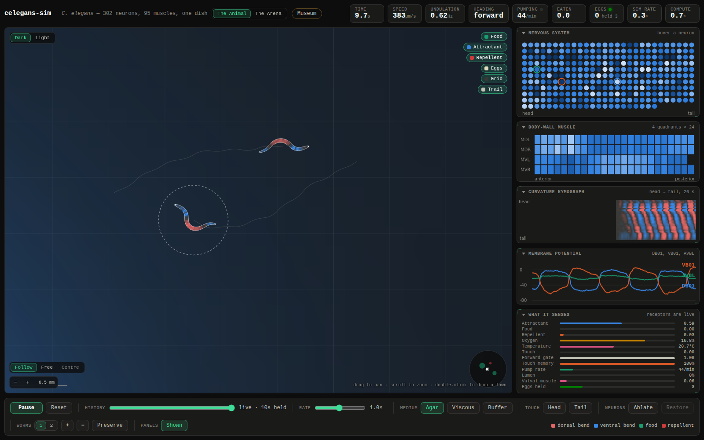
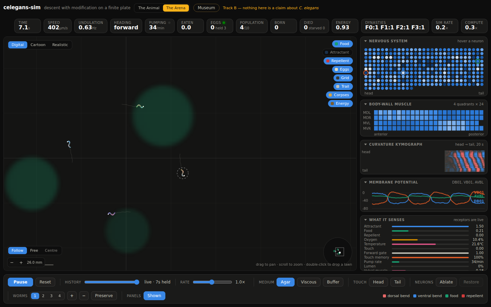

# celegans-sim

> Not affiliated with the [OpenWorm](https://openworm.org) project. It uses connectome data
> that OpenWorm publishes, and owes a lot to the modelling literature they have gathered,
> but none of the code here is theirs and none of the results are their responsibility.

A *Caenorhabditis elegans* simulated from its connectome down: 302 graded-potential
neurons wired by the reconstructed synapse-by-synapse anatomy, driving 95 individually
simulated body-wall muscle cells, driving an inextensible body in a viscous medium at
zero Reynolds number, inside a petri dish with food, chemical gradients, a thermal
gradient and obstacles. It smells with both ends, it feeds, lays eggs — and it sleeps:
RIS-gated quiescence on a satiety homeostat, poke-wakeable, abolished by ablating the
one neuron the biology says to ablate. Plus a browser front end to watch it all in.

The worm is the project. The web app is a media player for it.



## Sixty seconds to a worm

```bash
python3 -m venv .venv                      # Python 3.10 or newer
.venv/bin/python -m pip install -e .
.venv/bin/python tools/fetch_raw.py        # downloads pinned, verified anatomy, ~600 kB
.venv/bin/python tools/build_dataset.py    # -> data/celegans.json
.venv/bin/python run.py                    # then open http://127.0.0.1:8080
```

Or with nothing but Docker — the animal is compiled to WebAssembly and runs in *your
browser*, so the image is a static file server and the CPU cost is the visitor's:

```bash
docker build -t celegans-sim . && docker run --rm -p 8080:8080 celegans-sim
```

## The loop

Every timestep runs the same cycle the animal does. Nothing in the middle is scripted.

```
    world  ->  sensory neurons  ->  connectome  ->  motor neurons
       ^                                                   |
       |                                                   v
    body position <-  mechanics  <-  bending moment  <-  muscles
       |                                                   ^
       +----------------- proprioception ------------------+
```

The full account — the neuron model and where it deliberately departs from the reference
implementations, the muscle cascade, where the rhythm comes from (the part that took
longest), the mechanics, the dish, and every correction this project has had to publish
about itself — lives in **[docs/model.md](docs/model.md)**.

## Does it behave like a worm?

Reference values are measurements on live animals; the model column is mean and spread
over five seeds from a single run of `tools/scorecard.py`, so every row describes the
same animal.

<!-- scorecard:begin (generated by tools/scorecard.py --emit; do not hand-edit) -->
| Quantity | Model | Measured | Source |
|---|---|---|---|
| Curvature, r.m.s. | **4.52 ± 0.09 /mm** | 4.3 ± 0.3 /mm | Krajacic et al. 2012 |
| Curvature, peak | **12.9 ± 0.5 /mm** *(sharp)* | 9.8 ± 1.1 /mm | Krajacic et al. 2012 |
| Wave direction | **head → tail** (5/5 seeds) | head → tail | — |
| Muscle resting potential | **-22.0 mV** *(a point, not a range)* | −25.0 ± 1.0 mV | Gao & Zhen 2011 |
| Resting potentials | **-62 to -12 mV**, median -39 | −75 to −25 mV | several, see `params.py` |
| Swimming efficiency U/c | **0.043 ± 0.014** *(low)* | 0.08 ± 0.01 | Shen et al. 2012 |
| Neuron count / classes | **302 / 118** | 302 / 118 | canonical |
| GABAergic neurons | **26** | 26 | McIntire et al. 1993 |
| Crawling speed (net) | **0.272 ± 0.088 mm/s** | 0.219 ± 0.029 mm/s | Ramot et al. 2008 |
| Net displacement / path | **0.73 ± 0.21** | well above 0.5 | — |
| Travelling-wave index | **+0.87 ± 0.04** | +1 for a pure travelling wave | — |
| Undulation frequency, agar | **0.67 ± 0.02 Hz** | 0.30 ± 0.02 Hz | Fang-Yen et al. 2010 |
| Wavelength, agar | **0.85 ± 0.01 L** *(long)* | 0.65 ± 0.03 L | Fang-Yen et al. 2010 |

*(Measured 2026-08-26 at `7a3159d` by `tools/scorecard.py`: 5 seeds × 40 s, three media,
every row from the same run. Regenerate with `tools/scorecard.py --emit`, or dispatch the `scorecard` workflow.)*
<!-- scorecard:end -->

Curvature, wave direction and the neuron resting potentials land on the measured values;
the muscle rest is a point at `v_half` by construction and sits 2 mV shy of the band, the
swimming efficiency runs low, and the gait's timing is off — and
[docs/model.md](docs/model.md) says exactly how far and why, including a long section
titled *what it does not get right*, kept in front rather than buried, because a
simulation that oversells itself is worse than useless. (Three of these rows spent months
quoting numbers no tool had produced; the correction is part of the record there too.)

## Two tracks, never blurred

This repository serves two purposes that must not be confused for each other. **Track A**
is the reconstruction: anatomy is fact, measured constants are facts, and every claim
about the animal comes from the unevolved baseline. **Track B** is a digital-life
laboratory — populations under selection in an arena with metabolism, death, corpses that
rot, weather, and heritable genes, wiring, and body shapes. Evolved animals are **not**
*C. elegans*, and nothing they do is evidence about the animal; what they find instead is
every defect and exploitable niche of the reconstruction, which is catalogued — measured
and pinned — in **[the niche museum](web/museum.md)**.
[docs/project-architecture.md](docs/project-architecture.md) is the short, binding
statement of that line.



## Doors

| | |
|---|---|
| **[docs/model.md](docs/model.md)** | the whole model, its evidence, and its published corrections |
| **[docs/deploy.md](docs/deploy.md)** | the browser runtime, the viewer's controls, serving it yourself |
| **[web/museum.md](web/museum.md)** | the niche museum — served live at `/museum.html` on any deployment |
| **[docs/research-log/](docs/research-log/README.md)** | the working log, preserved append-only — how these results were actually reached |
| **[NEXT.md](NEXT.md)** | the live frontier: what is being worked on right now |
| **[docs/runtime-parity.md](docs/runtime-parity.md)** | read before changing any model default |
| **[wasm/README.md](wasm/README.md)** | Python is the compiler, WebAssembly is the runtime |
| **[docs/design/DOCKET.md](docs/design/DOCKET.md)** | the UI design-language exploration |
| **[CONTRIBUTING.md](CONTRIBUTING.md)** | conventions, and how to run every check locally |

## Layout, briefly

```
worm/       the model: params (every constant with provenance), nervous, muscle,
            body, world, senses, modulators, sleep, pharynx, egglaying, engine, server
tools/      ~75 measurement instruments; tools/README.md is the index
wasm/       the browser runtime and its test suites
web/        the viewer: native ES modules, no build step, no dependencies
tests/      the Python suite (~37 min) — the load-bearing behavioural checks
data/       the derived connectome dataset, hash-pinned to its inputs
```

## Data and licensing

The code is MIT (see `LICENSE`). The anatomical data is not mine and is not redistributed
here: `tools/fetch_raw.sh` downloads it from the original hosts, and `data/raw/` is
gitignored. What *is* committed is `data/celegans.json`, the derived dataset, which records
the SHA-256 of every input it was built from so you can check that your download matches
the one these results came from. Re-derive it yourself with `tools/build_dataset.py` if you
would rather not take my word for it.

If you use the anatomy, cite the people who spent years producing it — White, Southgate,
Thomson & Brenner (1986), Chen, Hall & Chklovskii (2006), Cook et al. (2019), and WormAtlas
— not this repository.

## Sources

Connectome and anatomy: White et al. 1986 and Chen, Hall & Chklovskii 2006, via the
OpenWorm c302 distribution; WormAtlas soma positions; Cook et al. 2019 (used to
cross-validate the muscle roster). Neuron model: Wicks et al. 1996; Kunert et al. 2014;
Liu et al. 2018. Mechanics: Boyle, Berri & Cohen 2012; Fang-Yen et al. 2010; Berri et al.
2009; Gray & Hancock 1955. Proprioception: Wen et al. 2012; Yeon et al. 2018. Transmitters:
McIntire et al. 1993; Beg & Jorgensen 2003; Gendrel, Atlas & Hobert 2016. Full citations
are inline at the point each number is used, in `worm/params.py`.
